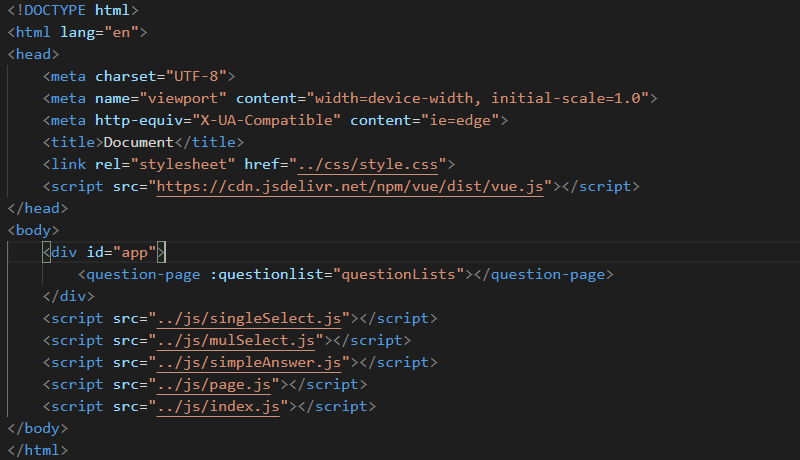

## Here is a questionnaire component written in Vue  
You just need to pass the data of the problem to the component, which will automatically generate the questionnaire for you.  
For example:  

  
You'll get a questionnaire of your incoming data.  

  
Of course, an important problem is that only one question is displayed at a time, and you can switch the topic by clicking on the last one or the next one.  
>This component can only generate three types of questions, single-choice questions, multiple-choice questions and short-answer questions, each corresponding to the type of 0, 1, 2, respectively.If necessary, you can customize the data.